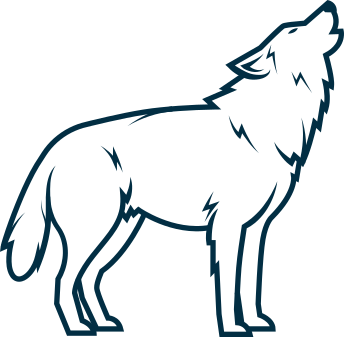
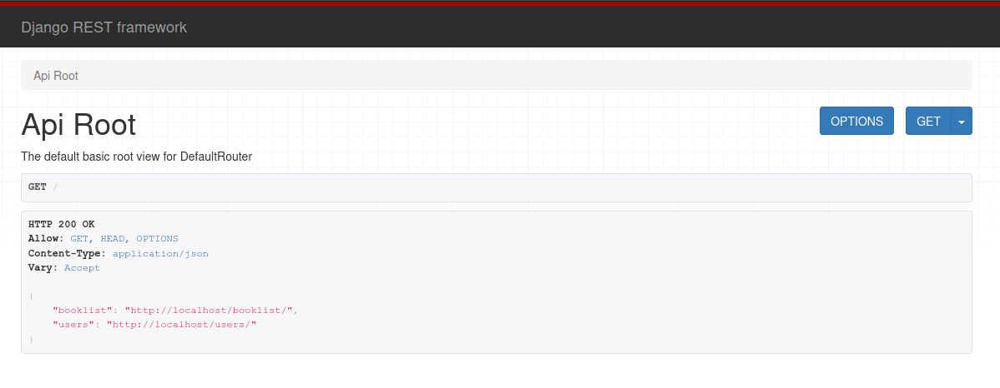

# AF-117
## Arctic fox 117
### Get started
- Install Docker with the Compose plugin (see: https://docs.docker.com/compose/install/)
- Clone this project
  ```shell
  git clone https://github.com/vetus-dominus/AF-117.git
  ```
- Create .env file for settings SMTP (uncomment and check lines for local develod machine)
```shell
nano AF-117/backend/.env
```
```text
# MYSQL SETTINGS
# DB_NAME               = 'library'
# DB_HOST               = '127.0.0.1'
# DB_PORT               = '3306'
# DB_USER               = 'root'
# DB_PASSWORD           = 'password'
#
# CELERY SETTINGS
# CELERY_BROKER_URL     = 'redis://127.0.0.1:6379'
# CELERY_RESULT_BACKEND = 'redis://127.0.0.1:6379'
#
# EMAIL SMTP SETTINGS
MAIL_FROM             = '<YOUR EMAIL>'
EMAIL_HOST            = 'smtp.yandex.ru'
EMAIL_USE_TLS         = ''
EMAIL_USE_SSL         = True
EMAIL_PORT            = 465
EMAIL_HOST_USER       = '<YOUR USERNAME>'
EMAIL_HOST_PASSWORD   = '<YOUR PASSWORD>'
```
_Without SMTP setting, mail sending not working_
- Create and run Docker container
  ```shell
  cd AF-117
  docker compose build
  docker compose up -d
  ```
- Open the URL http://localhost/ in your browser.
  You will be see Django REST framework dashboard.



### API overview
#### Book list
- Get all records - ```GET /booklist/```
- Get row by ID - ```GET /booklist/<ID>```
- Create new row - ```POST /booklist/```
- Modify record - ```PUT /booklist/<ID>```
- Delete record - ```DELETE /booklist/<ID>```
#### Users
- Get all records - ```GET /users/```
- Get row by ID - ```GET /users/<ID>```
- Create new row - ```POST /users/```
- Modify record - ```PUT /users/<ID>```
- Delete record - ```DELETE /users/<ID>```

For overview features we recommended use Django REST framework (http://localhost/)
